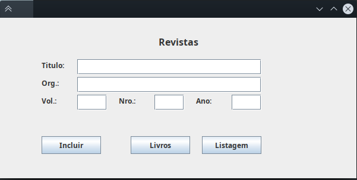

# Prática 3

**Universidade Federal de Uberlândia**

**Ciência da Computação**

**Programação Orientada a Objetos 2**

**Aluno:** Otávio Almeida Leite

11911BCC010

---

# Explicação sobre a resolução

A ideia central foi basicamente seguir o que foi instruído pelo professor na videoaula, no sentido de utilizar o Hibernate com as configurações de mapeamento explicitadas através de anotações nas classes que representavam entidades no banco de dados. Além disso, foram utilizadas classes do tipo `Repository` como camada de interação de persistência de dados, adicionando essa camada à estrutura geral do código do programa. Essas foram as principais adições nesse código quando comparado ao código da Prática 1, além da adição dos testes unitários, gerenciamento de dependências com o Maven e configurações relacionadas tanto a ele quanto ao próprio Hibernate. Serão detalhadas a seguir.

Em primeiro lugar, foi configurado o arquivo `pom.xml` com as dependências necessárias. A maior parte do arquivo foi gerada automaticamente pelo Maven, e em seguida as dependências foram adicionadas. Para esse programa, foi utilizado um banco MySQL para a persistência de dados. Assim, as dependências colocadas foram: `junit` para trabalhar com testes unitários, `mysql-connector-java` por conta da conexão com o banco, `hibernate-core` como implementação da especificação JPA, e por último `javax.xml.bind` e `org.glassfish.jaxb` adicionados ao projeto com o intuito de corrigir erros de classes não encontradas que apareceram durante a configuração do Hibernate.

Partindo para a explicação das classes do domínio, que agora foram agrupadas no pacote `entity` , elas ainda seguem a mesma hierarquia existente anteriormente. Ou seja, ainda existe uma classe Material, da qual herdam as classes Livro e Revista. Agora, porém, estão presentes anotações referentes ao mapeamento para o banco de dados, assim como pequenas alterações de adaptação. A classe Material está marcada como `@MappedSuperclass` , já que é uma classe que não deve ser mapeada diretamente para uma tabela, mas sim ter seus campos incluídos nas tabelas que mapeam as classes que herdam dela. Seus atributos ano e titulo estão devidamente anotados como colunas no banco, e foi adicionado o atributo `int id` , anotado como `@Id` e `@GeneratedValue` para ser utilizado como chave primária no banco e não ser necessário atribuí-lo em código (a atribuição será automática durante a inserção na tabela). Tanto a classe Revista como a classe Livro foram anotadas como entidades que mapeiam para tabelas do banco (tabelas "revista" e "livro", respectivamente),  e seus atributos específicos também foram mapeados para colunas nas respectivas tabelas. Em geral, os métodos dessas classes foram mantidos, dado que interagem com essas classes ao nível de domínio, o que não entra em conflito com a estrutura de persistência de dados. Porém, foi adicionados os chamados "construtores padrão" (*default constructors*), que são construtores "vazios", para que o JPA pudesse inicializar essas classes da própria maneira, sem que conflitasse com as definições lógicas dos construtores utilizados em código. Essa escolha aconteceu após problemas na execução de tentativas de listagem do banco através do Hibernate: nenhuma informação conseguia ser recuperada, e o erro apontado era que essas classes não tinham "construtores padrão" definidos, e acredito que o fato de o campo id, por exemplo, não aparecer no construtor definido anteriormente possa ser uma fonte desse problema (um atributo que existia no banco, mas não é parâmetro daquele construtor).

Com relação às classes do pacote `repository`, elas são as responsáveis por controlar a persistência dos dados da camada de código para o banco em si. Ambas as classes `RevistaRepository` e `LivroRepository` seguem o mesmo raciocínio, trabalhando de forma análoga, cada uma com sua respectiva entidade do domínio. Caso houvesse diferentes regras de negócio que demandassem diferentes consultas no banco, por exemplo, essas consultas poderiam ser implementadas como métodos dessas classes. O método `save` é responsável por persistir os dados de um objeto daquela entidade, que recebe como parâmetro. Os métodos `findAll` e `findById` fazem consultas de todas as entidades e apenas uma entidade de acordo com o id, respectivamente.

As classes do pacote `ginterface` representam as telas, e seguem exatamente o mesmo raciocínio descrito na Prática 1. A única diferença é que agora cada uma das telas de inclusão de novos elementos (`TelaLivro` e `TelaRevista`) recebe uma instância do `Repository` correspondente, ao invés de receber a referência de uma lista onde os novos elementos seriam inseridos, como era feito anteriormente. O motivo disso é claro: as novas instâncias serão, agora, inseridas no banco através do método `save` da classe `Repository` correspondente, que será executado quando o usuário clicar no botão "*Incluir*", presente nessas telas de inclusão.

Na classe principal, `App`, são adicionados os processos necessários para o instanciamento dos `repository`, que é basicamente a definição de um `EntityManagerFactory` da entidade correspondente, que será utilizado para criar uma instância da classe `EntityManager`, que por sua vez será passada como parâmetro para o construtor do `Repository` correspondente. Além disso, o `ActionListener` da tela de listagem, que é definido no escopo do método `App.main`, foi redefinido para realizar a consulta dos dados no banco através dos `Repository`. Ambos os métodos `findAll` são chamados, e os resultados são ambos adicionados na mesma lista, que o programa utiliza para atualizar o que é mostrado na tela de listagem de fato.

Por último, três testes foram implementados utilizando o JUnit. O primeiro testa apenas se a instanciação de um novo `App` foi feita com sucesso. O segundo testa se um novo livro consegue ser inserido e recuperado do banco de dados com sucesso, utilizando todas as classes e passos necessários para isso. Por último, o terceiro teste é análogo ao segundo, mas testa a inserção e recuperação de uma nova revista.

---

# Interfaces implementadas


Tela de inclusão de livros



Tela de inclusão de revistas


Tela de listagem (conteúdo ilustrativo)


Tela de sucesso de inserção de revista


Tela de sucesso de inserção de livro


Exemplo de tela de erro, mostrando que título de revista não pode estar vazio

---

# Código Fonte

O código fonte desse projeto também pode ser encontrado no repositório do GitHub referente aos meus trabalhos na disciplina:

[GitHub - atoivat/poo2: Códigos referentes à disciplina de Programação Orientada a Objetos 2 na Universidade Federal de Uberlândia, 2021.](https://github.com/atoivat/poo2)

Ou ainda, através do link direto para a pasta desta atividade:

[poo2/pratica-3/p3 at master · atoivat/poo2](https://github.com/atoivat/poo2/tree/master/pratica-3/p3)

Estrutura do projeto:

```
p3
├── pom.xml
└── src
    ├── main
    │   ├── java
    │   │   └── poo2
    │   │       ├── App.java
    │   │       ├── entity
    │   │       │   ├── Livro.java
    │   │       │   ├── Material.java
    │   │       │   └── Revista.java
    │   │       ├── ginterface
    │   │       │   ├── TelaBase.java
    │   │       │   ├── TelaIncluirBase.java
    │   │       │   ├── TelaListagem.java
    │   │       │   ├── TelaLivro.java
    │   │       │   └── TelaRevista.java
    │   │       └── repository
    │   │           ├── LivroRepository.java
    │   │           └── RevistaRepository.java
    │   └── resources
    │       └── META-INF
    │           └── persistence.xml
    └── test
        └── java
            └── poo2
                └── AppTest.java
```

pom.xml

```xml
<?xml version="1.0" encoding="UTF-8"?>

<project xmlns="http://maven.apache.org/POM/4.0.0" xmlns:xsi="http://www.w3.org/2001/XMLSchema-instance"
  xsi:schemaLocation="http://maven.apache.org/POM/4.0.0 http://maven.apache.org/xsd/maven-4.0.0.xsd">
  <modelVersion>4.0.0</modelVersion>

  <groupId>poo2</groupId>
  <artifactId>p3</artifactId>
  <version>1.0-SNAPSHOT</version>

  <name>p3</name>
  <!-- FIXME change it to the project's website -->
  <url>http://www.example.com</url>

  <properties>
    <project.build.sourceEncoding>UTF-8</project.build.sourceEncoding>
    <maven.compiler.release>11</maven.compiler.release>
  </properties>

  <dependencies>
    <dependency>
      <groupId>junit</groupId>
      <artifactId>junit</artifactId>
      <version>4.11</version>
      <scope>test</scope>
    </dependency>
    <dependency>
	  <groupId>org.hibernate</groupId>
	  <artifactId>hibernate-core</artifactId>
	  <version>5.3.7.Final</version>
	</dependency>
    <dependency>
      <groupId>mysql</groupId>
      <artifactId>mysql-connector-java</artifactId>
      <version>8.0.26</version>
    </dependency>
    <dependency>
      <groupId>javax.xml.bind</groupId>
      <artifactId>jaxb-api</artifactId>
      <version>2.3.1</version>
    </dependency>
    <dependency>
      <groupId>org.glassfish.jaxb</groupId>
      <artifactId>jaxb-runtime</artifactId>
      <version>2.3.1</version>
    </dependency>
  </dependencies>

  <build>
    <pluginManagement><!-- lock down plugins versions to avoid using Maven defaults (may be moved to parent pom) -->
      <plugins>
        <!-- clean lifecycle, see https://maven.apache.org/ref/current/maven-core/lifecycles.html#clean_Lifecycle -->
        <plugin>
          <artifactId>maven-clean-plugin</artifactId>
          <version>3.1.0</version>
        </plugin>
        <!-- default lifecycle, jar packaging: see https://maven.apache.org/ref/current/maven-core/default-bindings.html#Plugin_bindings_for_jar_packaging -->
        <plugin>
          <artifactId>maven-resources-plugin</artifactId>
          <version>3.0.2</version>
        </plugin>
        <plugin>
          <artifactId>maven-compiler-plugin</artifactId>
          <version>3.8.1</version>
        </plugin>
        <plugin>
          <artifactId>maven-surefire-plugin</artifactId>
          <version>2.22.1</version>
        </plugin>
        <plugin>
          <artifactId>maven-jar-plugin</artifactId>
          <version>3.0.2</version>
        </plugin>
        <plugin>
          <artifactId>maven-install-plugin</artifactId>
          <version>2.5.2</version>
        </plugin>
        <plugin>
          <artifactId>maven-deploy-plugin</artifactId>
          <version>2.8.2</version>
        </plugin>
        <!-- site lifecycle, see https://maven.apache.org/ref/current/maven-core/lifecycles.html#site_Lifecycle -->
        <plugin>
          <artifactId>maven-site-plugin</artifactId>
          <version>3.7.1</version>
        </plugin>
        <plugin>
          <artifactId>maven-project-info-reports-plugin</artifactId>
          <version>3.0.0</version>
        </plugin>
      </plugins>
    </pluginManagement>
  </build>
</project>
```

App.java

```java
package poo2;

import java.util.LinkedList;

import javax.persistence.EntityManager;
import javax.persistence.EntityManagerFactory;
import javax.persistence.Persistence;

import java.awt.event.ActionListener;
import java.awt.event.ActionEvent;

import poo2.entity.Material;
import poo2.ginterface.TelaListagem;
import poo2.ginterface.TelaLivro;
import poo2.ginterface.TelaRevista;
import poo2.repository.LivroRepository;
import poo2.repository.RevistaRepository;

public class App {
    private EntityManagerFactory entityManagerFactoryLivro = Persistence.createEntityManagerFactory("Livro");
    private EntityManager entityManagerLivro = entityManagerFactoryLivro.createEntityManager();
    
    private EntityManagerFactory entityManagerFactoryRevista = Persistence.createEntityManagerFactory("Revista");
    private EntityManager entityManagerRevista = entityManagerFactoryRevista.createEntityManager();

    private LivroRepository livroRepository = new LivroRepository(entityManagerLivro);
    private RevistaRepository revistaRepository = new RevistaRepository(entityManagerRevista);

    private TelaLivro iLivro = new TelaLivro(livroRepository);
    private TelaRevista iRevista = new TelaRevista(revistaRepository);
    private TelaListagem iListagem = new TelaListagem();

    public static void main(String[] args) throws Exception {
        App app = new App();
        app.iLivro.setVisible(true);
        app.iLivro.getToggleButton().addActionListener(new ActionListener() {
            public void actionPerformed(ActionEvent e) {
                app.iLivro.setVisible(false);
                app.iRevista.setVisible(true);
            }
        });
        app.iRevista.getToggleButton().addActionListener(new ActionListener() {
            public void actionPerformed(ActionEvent e) {
                app.iRevista.setVisible(false);
                app.iLivro.setVisible(true);
            }
        });
        
        ActionListener listagemActionListener = new ActionListener() {
            public void actionPerformed(ActionEvent e) {
                LinkedList<Material> list = new LinkedList<Material>();
                list.addAll(app.livroRepository.findAll());
                list.addAll(app.revistaRepository.findAll());
                app.iListagem.setDisplay(list);
                app.iListagem.setVisible(true);
                app.iListagem.repaint();
            }
        };

        app.iRevista.getListButton().addActionListener(listagemActionListener);
        app.iLivro.getListButton().addActionListener(listagemActionListener);
    }
}
```

entity/Livro.java

```java
package poo2.entity;

import javax.persistence.Column;
import javax.persistence.Entity;
import javax.persistence.Table;

@Entity
@Table(name="livro")
public class Livro extends Material{
    @Column(name = "autor")
    private String autor;

    public Livro(String titulo, String autor, String ano) throws IllegalArgumentException {
        super(titulo, ano);
        setAutor(autor);
    }

    public Livro(){}
    
    public String getAutor() {
        return autor;
    }
    
    public void setAutor(String autor) {
        this.autor = validateString(autor, "autor");
    }

    public String toString() {
        return "Livro [titulo=" + this.getTitulo() + ", autor=" + autor + ", ano=" + this.getAno() + "]";
    }
}
```

entity/Material.java

```java
package poo2.entity;

import javax.persistence.Column;
import javax.persistence.GeneratedValue;
import javax.persistence.Id;
import javax.persistence.MappedSuperclass;

@MappedSuperclass
public class Material {
    @Id
    @GeneratedValue
    private int id;

    @Column(name="titulo")
    private String titulo;
    
    @Column(name="ano")
    private int ano;

    public Material(String titulo, String ano) throws IllegalArgumentException {
        setTitulo(titulo);
        setAno(ano);
    }

    public Material(){}
    
    public String getTitulo() {
        return titulo;
    }
    
    public void setTitulo(String titulo) {
        this.titulo = validateString(titulo, "título");
    }
    
    public int getAno() {
        return ano;
    }

    public int getId() {
        return id;
    }
    
    public void setAno(String ano) {
        this.ano = validadeInteger(ano, "ano");
    }

    public String toString() {
        return "Material [titulo=" + titulo + ", ano=" + ano + "]";
    }

    public static int validadeInteger(String integerString, String attrName) throws IllegalArgumentException {
        int integer;
        try{
            integer = Integer.parseInt(integerString);
        } catch(Exception e) {
            throw new IllegalArgumentException("Argumento inválido '" + attrName + "'");
        }
        if(integer <= 0) {
            throw new IllegalArgumentException("Argumento inválido '" + attrName + "'");
        }
        return integer;
    }

    public static String validateString(String toValidade, String attrName) throws IllegalArgumentException {
        if(toValidade == null || toValidade.isBlank()) {
            throw new IllegalArgumentException("Argumento inválido '" + attrName + "'");
        }
        return toValidade.strip();
    }
}
```

entity/Revista.java

```java
package poo2.entity;

import javax.persistence.Column;
import javax.persistence.Entity;
import javax.persistence.Table;

@Entity
@Table(name="revista")
public class Revista extends Material{
    @Column(name = "org")
    private String org;
    
    @Column(name = "vol")
    private int vol;

    @Column(name = "nro")
    private int nro;

    public Revista(String titulo, String org, String vol, String nro, String ano) throws IllegalArgumentException {
        super(titulo, ano);
        setOrg(org);
        setVol(vol);
        setNro(nro);
    }

    public Revista(){}
    
    public String getOrg() {
        return org;
    }
    
    public void setOrg(String org) {
        this.org = validateString(org, "org");
    }

    public int getVol() {
        return vol;
    }

    public void setVol(String vol) {
        this.vol = validadeInteger(vol, "vol");
    }

    public int getNro() {
        return nro;
    }

    public void setNro(String nro) {
        this.nro = validadeInteger(nro, "nro");
    }

    public String toString() {
        return "Revista [titulo=" + this.getTitulo() + ", org=" + org + ", nro=" + nro + ", vol=" + vol + ", ano=" + this.getAno() + "]";
    }
}
```

ginterface/TelaBase.java

```java
package poo2.ginterface;

import java.awt.Font;

import javax.swing.JFrame;
import javax.swing.JLabel;
import javax.swing.JOptionPane;
import javax.swing.JPanel;
import javax.swing.SwingConstants;
import javax.swing.border.EmptyBorder;

public class TelaBase extends JFrame {
    protected JPanel contentPane;
    protected JLabel titleLabel;

    public TelaBase(String title) {
        setDefaultCloseOperation(JFrame.EXIT_ON_CLOSE);
        setBounds(100, 100, 600, 300);

        contentPane = new JPanel();
        contentPane.setBorder(new EmptyBorder(5, 5, 5, 5));
        setContentPane(contentPane);
        contentPane.setLayout(null);

        titleLabel = new JLabel(title);
        titleLabel.setHorizontalAlignment(SwingConstants.CENTER);
        titleLabel.setFont(new Font("Tahoma", Font.BOLD, 16));
        titleLabel.setBounds(200, 30, 200, 20);
        contentPane.add(titleLabel);
    }

    public void errorPanel(String msg) {
        JOptionPane.showMessageDialog(this, msg, "ERROR", JOptionPane.ERROR_MESSAGE);
    }

    public void successPanel(String msg) {
        JOptionPane.showMessageDialog(this, msg, "INFORMATION", JOptionPane.INFORMATION_MESSAGE);
    }
}
```

ginterface/TelaIncluirBase.java

```java
package poo2.ginterface;

import javax.swing.JButton;
import javax.swing.JLabel;
import javax.swing.JTextField;

public class TelaIncluirBase extends TelaBase {
    protected JButton addButton;
    protected JButton toggleButton;
    protected JButton listButton;
    protected JLabel firstLabel;
    protected JTextField firstTextField;
    protected JLabel secondLabel;
    protected JTextField secondTextField;
    protected JLabel thirdLabel;
    protected JTextField thirdTextField;

    public TelaIncluirBase(String title, String toggleTitle, String first, String second, String third) {
        super(title);

        addButton = new JButton("Incluir");
        addButton.setBounds(70, 200, 100, 30);
        contentPane.add(addButton);
        
        toggleButton = new JButton(toggleTitle);
        toggleButton.setBounds(220, 200, 100, 30);
        contentPane.add(toggleButton);
        
        listButton = new JButton("Listagem");
        listButton.setBounds(340, 200, 100, 30);
        contentPane.add(listButton);

        firstLabel = new JLabel(first);
        firstLabel.setBounds(70, 70, 70, 20);
        contentPane.add(titleLabel);
        
        first = first.concat(":");
        firstLabel = new JLabel(first);
        firstLabel.setBounds(70, 70, 70, 20);
        contentPane.add(firstLabel);

        firstTextField = new JTextField();
        firstTextField.setBounds(130, 70, 310, 26);
        contentPane.add(firstTextField);
        firstTextField.setColumns(10);
        
        second = second.concat(":");
        secondLabel = new JLabel(second);
        secondLabel.setBounds(70, 100, 70, 20);
        contentPane.add(secondLabel);
        
        secondTextField = new JTextField();
        secondTextField.setBounds(130, 100, 310, 26);
        contentPane.add(secondTextField);
        secondTextField.setColumns(10);
        
        third = third.concat(":");
        thirdLabel = new JLabel(third);
        thirdLabel.setBounds(70, 130, 70, 20);
        contentPane.add(thirdLabel);
        
        thirdTextField = new JTextField();
        thirdTextField.setBounds(130, 130, 50, 26);
        contentPane.add(thirdTextField);
        thirdTextField.setColumns(10);

    }

    public JButton getToggleButton() {
        return toggleButton;
    }

    public JButton getListButton() {
        return listButton;
    }
}
```

ginterface/TelaListagem.java

```java
package poo2.ginterface;

import java.util.List;

import javax.swing.JFrame;
import javax.swing.JScrollPane;
import javax.swing.JTextArea;

import poo2.entity.Material;

public class TelaListagem extends TelaBase {
    private JTextArea textArea;
    private JScrollPane scrollPane;

    public TelaListagem() {
        super("Listagem");
        setDefaultCloseOperation(JFrame.HIDE_ON_CLOSE);

        textArea = new JTextArea(50, 50);
        textArea.setBounds(10, 70, 580, 220);
        contentPane.add(textArea);
        textArea.setColumns(10);

        scrollPane = new JScrollPane(textArea);
        scrollPane.setBounds(10, 70, 580, 190);

        contentPane.add(scrollPane);
    }

    public void setDisplay(List<Material> listagem) {
        textArea.setEditable(true);
        String displayString = "";
        for(Material item: listagem){
            displayString += item + "\n";
        }
        textArea.setText(displayString);
        textArea.setEditable(false);
    }
}
```

ginterface/TelaLivro.java

```java
package poo2.ginterface;

import java.awt.event.ActionListener;
import java.awt.event.ActionEvent;

import poo2.entity.Livro;
import poo2.repository.LivroRepository;

public class TelaLivro extends TelaIncluirBase {
    private LivroRepository livroRepository;

    public TelaLivro(LivroRepository livroRepository) {
        super("Livros", "Revistas", "Titulo", "Autor", "Ano");
        this.livroRepository = livroRepository;

        addButton.addActionListener(new ActionListener() {
            public void actionPerformed(ActionEvent e){
                String titulo = firstTextField.getText();
                String autor = secondTextField.getText();
                String ano = thirdTextField.getText();
                try{
                    Livro l = new Livro(titulo, autor, ano);
                    livroRepository.save(l);

                    successPanel("Livro adicionado com sucesso!");

                    firstTextField.setText("");
                    secondTextField.setText("");
                    thirdTextField.setText("");
                } catch (Exception exc) {
                    errorPanel(exc.getMessage());
                }
            }
        });
    }
}
```

ginterface/TelaRevista.java

```java
package poo2.ginterface;

import java.awt.event.ActionListener;
import java.awt.event.ActionEvent;

import javax.swing.JLabel;
import javax.swing.JTextField;

import poo2.entity.Revista;
import poo2.repository.RevistaRepository;

public class TelaRevista extends TelaIncluirBase {
    private JLabel nroLabel;
    private JTextField nroTextField;
    private JLabel anoLabel;
    private JTextField anoTextField;

    private RevistaRepository revistaRepository;

    public TelaRevista(RevistaRepository revistaRepository) {
        super("Revistas", "Livros", "Titulo", "Org.", "Vol.");
        this.revistaRepository = revistaRepository;

        nroLabel = new JLabel("Nro.:");
        nroLabel.setBounds(200, 130, 70, 20);
        contentPane.add(nroLabel);
        
        nroTextField = new JTextField();
        nroTextField.setBounds(260, 130, 50, 26);
        contentPane.add(nroTextField);
        nroTextField.setColumns(10);
        
        anoLabel = new JLabel("Ano:");
        anoLabel.setBounds(330, 130, 70, 20);
        contentPane.add(anoLabel);
        
        anoTextField = new JTextField();
        anoTextField.setBounds(390, 130, 50, 26);
        contentPane.add(anoTextField);
        anoTextField.setColumns(10);

        addButton.addActionListener(new ActionListener () {
            public void actionPerformed(ActionEvent e){
                String titulo = firstTextField.getText();
                String org = secondTextField.getText();
                String vol = thirdTextField.getText();
                String nro = nroTextField.getText();
                String ano = anoTextField.getText();
                try{
                    Revista r = new Revista(titulo, org, vol, nro, ano);
                    revistaRepository.save(r);

                    successPanel("Revista adicionada com sucesso!");

                    firstTextField.setText("");
                    secondTextField.setText("");
                    thirdTextField.setText("");
                    nroTextField.setText("");
                    anoTextField.setText("");
                } catch (Exception exc) {
                    errorPanel(exc.getMessage());
                }
            }
        });
    }
}
```

repository/LivroRepository.java

```java
package poo2.repository;

import poo2.entity.Livro;

import java.util.List;
import java.util.Optional;

import javax.persistence.EntityManager;

public class LivroRepository {
    private EntityManager entityManager;
    
    public LivroRepository(EntityManager entityManager){
        this.entityManager = entityManager;
    }

    public Optional<Livro> save(Livro livro){
        try {
            entityManager.getTransaction().begin();
            entityManager.persist(livro);
            entityManager.getTransaction().commit();
            return Optional.of(livro);
        } catch (Exception e) {
            e.printStackTrace();
        }
        return Optional.empty();
    }

    public List<Livro> findAll() {
        return entityManager.createQuery("from Livro").getResultList();
    }

    public Optional<Livro> findById(Integer id) {
        Livro livro = entityManager.find(Livro.class, id);
        return livro != null ? Optional.of(livro) : Optional.empty();
    }
}
```

repository/RevistaRepository.java

```java
package poo2.repository;

import poo2.entity.Revista;

import java.util.List;
import java.util.Optional;

import javax.persistence.EntityManager;

public class RevistaRepository {
    private EntityManager entityManager;
    
    public RevistaRepository(EntityManager entityManager){
        this.entityManager = entityManager;
    }

    public Optional<Revista> save(Revista revista){
        try {
            entityManager.getTransaction().begin();
            entityManager.persist(revista);
            entityManager.getTransaction().commit();
            return Optional.of(revista);
        } catch (Exception e) {
            e.printStackTrace();
        }
        return Optional.empty();
    }

    public List<Revista> findAll() {
        return entityManager.createQuery("from Revista").getResultList();
    }

    public Optional<Revista> findById(Integer id) {
        Revista revista = entityManager.find(Revista.class, id);
        return revista != null ? Optional.of(revista) : Optional.empty();
    }
}
```

resources/META-INF/persistence.xml

```xml
<persistence xmlns="http://java.sun.com/xml/ns/persistence"
         xmlns:xsi="http://www.w3.org/2001/XMLSchema-instance"
         xsi:schemaLocation="http://java.sun.com/xml/ns/persistence http://java.sun.com/xml/ns/persistence/persistence_2_0.xsd"
         version="2.0">
  <persistence-unit name="Livro">
    <provider>org.hibernate.jpa.HibernatePersistenceProvider</provider>
    <class>poo2.entity.Livro</class>
    <properties>
      <property name="hibernate.connection.driver_class" value="com.mysql.jdbc.Driver"/>
      <property name="hibernate.connection.password" value="123456789"/>
      <property name="hibernate.connection.url" value="jdbc:mysql://localhost:3306/mysqldb"/>
      <property name="hibernate.connection.username" value="mysqldb"/>
      <property name="hibernate.dialect" value="org.hibernate.dialect.MySQL57Dialect"/>
      <property name="hibernate.hbm2ddl.auto" value="update"/>
    </properties>
  </persistence-unit>
  <persistence-unit name="Revista">
    <provider>org.hibernate.jpa.HibernatePersistenceProvider</provider>
    <class>poo2.entity.Revista</class>
    <properties>
      <property name="hibernate.connection.driver_class" value="com.mysql.jdbc.Driver"/>
      <property name="hibernate.connection.password" value="123456789"/>
      <property name="hibernate.connection.url" value="jdbc:mysql://localhost:3306/mysqldb"/>
      <property name="hibernate.connection.username" value="mysqldb"/>
      <property name="hibernate.dialect" value="org.hibernate.dialect.MySQL57Dialect"/>
      <property name="hibernate.hbm2ddl.auto" value="update"/>
    </properties>
  </persistence-unit>
</persistence>
```

test/java/poo2/AppTest.java

```java
package poo2;

import static org.junit.Assert.assertEquals;
import static org.junit.Assert.assertNotNull;

import java.util.Optional;

import javax.persistence.EntityManager;
import javax.persistence.EntityManagerFactory;
import javax.persistence.Persistence;

import org.junit.Test;

import poo2.entity.Livro;
import poo2.entity.Revista;
import poo2.repository.LivroRepository;
import poo2.repository.RevistaRepository;

public class AppTest 
{
    @Test
    public void consegueInstanciarOApp()
    {
        assertNotNull(new App());
    }
    
    @Test
    public void consegueSalvarERecuperarLivro()
    {
        EntityManagerFactory entityManagerFactoryLivro = Persistence.createEntityManagerFactory("Livro");
        EntityManager entityManagerLivro = entityManagerFactoryLivro.createEntityManager();

        LivroRepository livroRepository = new LivroRepository(entityManagerLivro);

        Livro l = new Livro("Teste", "teste", "2012");
        livroRepository.save(l);

        Optional<Livro> l2 = livroRepository.findById(l.getId());
        assertNotNull(l2);
        assertEquals(l, l2.get());
    }
    
    @Test
    public void consegueSalvarERecuperarRevista()
    {
        EntityManagerFactory entityManagerFactoryRevista = Persistence.createEntityManagerFactory("Revista");
        EntityManager entityManagerRevista = entityManagerFactoryRevista.createEntityManager();
    
        RevistaRepository revistaRepository = new RevistaRepository(entityManagerRevista);
    
        Revista r = new Revista("Teste", "1", "1", "1", "2012");
        revistaRepository.save(r);
    
        Optional<Revista> r2 = revistaRepository.findById(r.getId());
        assertNotNull(r2);
        assertEquals(r, r2.get());
    }
}
```