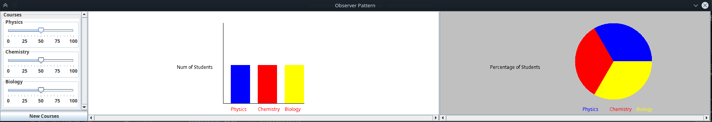
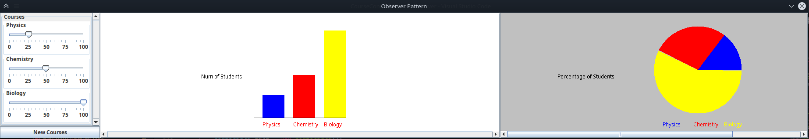
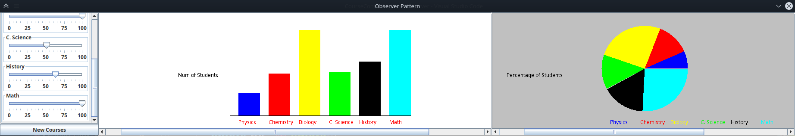

# Prática 07 - Observer

## Instruções passadas:


O conteúdo original deste exercício está em 
http://csserver.ucd.ie/~meloc/DesignPatternJavaExercises/Observer/Observer.htm


No link acima você encontrará o arquivo .zip, que contém código com Observer e sem Observer.

Para sua conveniência abaixo, você também encontra anexo tal arquivo .zip.

Monte os fontes disponíveis nestes arquivos em projetos no seu IDE de preferência. No Eclipse, basta criar um projeto e descompactar os respectivos arquivos na pasta src correspondente.

Estes dois programas fazem a mesma coisa, mas de maneira diferente. A tela é parecida com esta: 

Atividade: Modifique o programa com padrão para incluir o gráfico de Pizza. A tela deverá ficar parecida com esta abaixo. Dica: veja o arquivo how_to_draw_a_pie_chart.txt na versão sem padrão. Não precise preocupar com muitos detalhes de layout. Não é este o objetivo desta prática, mas sim a aplicação do padrão Observer. 

Explore a flexibilidade do Observer. A classe para PieChart precisa ser estendida para (1) saber onde está  SubjectData, (2) registrar no SliderSubject, e (3) manipular os updates de SliderSubject. Veja a classe BarChartObserver para ter uma ideia inicial.


ENTREGUE O CODIGO E UM PRINT DA TELA.

***

**Universidade Federal de Uberlândia**

**Ciência da Computação**

**Programação Orientada a Objetos 2**

**Aluno:** Otávio Almeida Leite

11911BCC010

---

Abaixo estão listados os prints de execução e o código fonte dos exercícios. Além deste documento, o código fonte também está disponível no repositório do GitHub destinado ao armazenamento dos códigos dessa disciplina.

Link do Repositório:

[GitHub - atoivat/poo2: Códigos referentes à disciplina de Programação Orientada a Objetos 2 na Universidade Federal de Uberlândia, 2021.](https://github.com/atoivat/poo2)

Link direto da pasta desta atividade:

[poo2/pratica-7 at master · atoivat/poo2](https://github.com/atoivat/poo2/tree/master/pratica-7)


# Execução











# Código Fonte
Estrutura do projeto:
```txt
.
└── src
    └── observer
        ├── CourseRecord.java
        ├── LayoutConstants.java
        ├── nonpattern
        │   └── CourseViewer.java
        └── pattern
            ├── BarChartObserver.java
            ├── CourseController.java
            ├── CourseData.java
            ├── Observable.java
            ├── Observer.java
            └── PieChartObserver.java
```

observer/CourseRecord.java
```java
package observer;

/**
 * Represents the name of a course and the number of students taking it.
 */
public class CourseRecord {
	/**
	 * Create a CourseRecord object
	 * 
	 * @param courseName
	 *            name of the course
	 * @param numOfStudents
	 *            number of students taking the course
	 */
	public CourseRecord(String courseName, int numOfStudents) {
		this.name = courseName;
		this.numOfStudents = numOfStudents;
	}

	/**
	 * Return the number of students taking course
	 * 
	 * @return number of students taking course
	 */
	public int getNumOfStudents() {
		return numOfStudents;
	}

	/**
	 * Return the name of the course
	 * 
	 * @return name of the course
	 */
	public String getName() {
		return name;
	}

	/**
	 * Set number of students on course
	 * 
	 * @param numOfStudents
	 *            number of students on course
	 */
	public void setNumOfStudents(int numOfStudents) {
		this.numOfStudents = numOfStudents;
	}

	/**
	 * Convert course to string representation
	 * 
	 * @return course represented as a string
	 */
	public String toString() {
		return "Course = " + this.name + ", Number of Students = "
				+ this.numOfStudents;
	}

	private String name;

	private int numOfStudents;
}
```

observer/LayoutConstants.java
```java
package observer;

import java.awt.Color;
import java.awt.Graphics;
import java.util.Vector;

/**
 	Represents some constants for the drawing of graphs in this example.
*/
public class LayoutConstants {

	public static final int xOffset = 350;

	public static final int yOffset = 30;

	public static final int graphHeight = 210;

	public static final int maxValue = 100;

	public static final int barHeight = 200;

	public static final int barWidth = 50;

	public static final int barSpacing = 20;

	public static final Color[] courseColours = { Color.BLUE, Color.RED,
			Color.YELLOW, Color.GREEN, Color.BLACK, Color.CYAN, Color.MAGENTA,
			Color.ORANGE, Color.PINK };
	
	public static void paintBarChartOutline(Graphics g, int noOfBars) {
		g.setColor(Color.black);
		g.drawString("Num of Students", LayoutConstants.xOffset - 120, 150);
		g.drawLine(LayoutConstants.xOffset, LayoutConstants.yOffset,
				LayoutConstants.xOffset, LayoutConstants.graphHeight
						+ LayoutConstants.yOffset);
		g.drawLine(LayoutConstants.xOffset, LayoutConstants.graphHeight
				+ LayoutConstants.yOffset, LayoutConstants.xOffset
				+ (LayoutConstants.barSpacing + LayoutConstants.barWidth)
				* noOfBars, LayoutConstants.graphHeight
				+ LayoutConstants.yOffset);
	}
	
	public static void paintPieChartOutline(Graphics g) {
		g.setColor(Color.black);
		g.drawString("Percentage of Students", LayoutConstants.xOffset - 220, 150);
	}
}

```

observer/nonpattern/CourseViewer.java
```java
package observer.nonpattern;

import java.awt.Color;
import java.awt.Graphics;
import java.awt.GridBagConstraints;
import java.awt.GridBagLayout;
import java.awt.GridLayout;
import java.awt.event.ActionEvent;
import java.awt.event.ActionListener;
import java.util.Vector;

import javax.swing.JButton;
import javax.swing.JFrame;
import javax.swing.JOptionPane;
import javax.swing.JPanel;
import javax.swing.JScrollPane;
import javax.swing.JSlider;
import javax.swing.border.TitledBorder;
import javax.swing.event.ChangeEvent;
import javax.swing.event.ChangeListener;

import observer.CourseRecord;
import observer.LayoutConstants;

/**
 * Presents a barchart view of a set of courses and their marks. No pattern is
 * used in this program.
 */
@SuppressWarnings("serial")
public class CourseViewer extends JFrame implements ActionListener, ChangeListener {

	/**
	 * Create a CourseViewer object
	 */
	public CourseViewer() {
		this.setTitle("Observer Pattern -- Non Pattern Version");
		this.setDefaultCloseOperation(JFrame.EXIT_ON_CLOSE);
		sliders = new Vector<JSlider>();
		sliderPanel = new JPanel();
		sliderPanel.setLayout(new GridBagLayout());
		sliderPanel.setBackground(Color.white);
		this.getContentPane().setLayout(new GridBagLayout());
		coursePanel = new JPanel();
		coursePanel.setBorder(new TitledBorder("Courses"));
		coursePanel.setLayout(new GridLayout(0, 1));
		GridBagConstraints constraints = new GridBagConstraints();
		constraints.fill = GridBagConstraints.BOTH;

		scrollPane = new JScrollPane(coursePanel,
				JScrollPane.VERTICAL_SCROLLBAR_ALWAYS,
				JScrollPane.HORIZONTAL_SCROLLBAR_AS_NEEDED);
		// Layout code
		constraints.weightx = 0.0;
		constraints.weighty = 1.0;
		constraints.gridx = 0;
		constraints.gridy = 0;
		sliderPanel.add(scrollPane, constraints);

		button = new JButton("New Course");
		button.addActionListener(this);

		// Layout code
		constraints.weightx = 0.0;
		constraints.weighty = 0.0;
		constraints.gridy = 1;
		sliderPanel.add(button, constraints);

		// Layout code
		constraints.weightx = 0.0;
		constraints.weighty = 0.0;
		constraints.gridx = 0;
		constraints.gridy = 0;
		this.getContentPane().add(sliderPanel, constraints);

		// Layout code
		constraints.weightx = 1.0;
		constraints.weighty = 1.0;
		constraints.gridx = 1;
		constraints.gridy = 0;
		// the bar chart will be drawn over this panel
		this.getContentPane().add(new JPanel(), constraints);
		this.setVisible(true);
	}

	/**
	 * Add a new Course object
	 * 
	 * @param courseRecord
	 *            the CourseRecord to be added
	 */
	public void addCourse(CourseRecord courseRecord) {
		boolean alreadyExists = false;
		for (int i = 0; i < sliders.size(); i++) {
			JSlider slider = sliders.elementAt(i);
			if (slider.getName().equals(courseRecord.getName())) {
				alreadyExists = true;
				JOptionPane
						.showMessageDialog(
								null,
								"Warning: Attempt to add new course with an already existing name",
								"alert", JOptionPane.ERROR_MESSAGE);
				i = sliders.size(); // exit the loop
			}
		}
		if (!alreadyExists) { // add the slider
			JSlider slider = new JSlider();
			slider.setBackground(Color.white);
			slider.setName(courseRecord.getName());
			slider.setValue(50);
			slider.setMinimum(0);
			slider.setMaximum(100);
			slider.setMajorTickSpacing(25);
			slider.setMinorTickSpacing(5);
			slider.setPaintTicks(true);
			slider.setPaintLabels(true);
			slider.setBorder(new TitledBorder(courseRecord.getName()));
			slider.addChangeListener(this);
			coursePanel.add(slider);
			coursePanel.revalidate();
			sliders.addElement(slider);
			this.setSize(LayoutConstants.xOffset + 50 + this.sliders.size()
					* (LayoutConstants.barWidth + LayoutConstants.barSpacing),
					(sliders.size() + 1) * 100 + this.button.getHeight());
			this.sliderPanel.revalidate();
			this.coursePanel.revalidate();
			this.repaint();
			this.setVisible(true);
		}
	}

	public void paint(Graphics g) {
		super.paint(g);
		LayoutConstants.paintBarChartOutline(g, sliders.size());
		for (int i = 0; i < sliders.size(); i++) {
			JSlider record = sliders.elementAt(i);
			g.setColor(LayoutConstants.courseColours[i]);
			g.fillRect(
					LayoutConstants.xOffset + (i + 1)
							* LayoutConstants.barSpacing + i
							* LayoutConstants.barWidth, LayoutConstants.yOffset
							+ LayoutConstants.graphHeight
							- LayoutConstants.barHeight + 2
							* (LayoutConstants.maxValue - record.getValue()),
					LayoutConstants.barWidth, 2 * record.getValue());
			g.setColor(Color.red);
			g.drawString(record.getName(),
					LayoutConstants.xOffset + (i + 1)
							* LayoutConstants.barSpacing + i
							* LayoutConstants.barWidth, LayoutConstants.yOffset
							+ LayoutConstants.graphHeight + 20);
		}
	}

	/**
	 * Manages the creation of a new course. Called when "New Course" button is pressed.
	 * 
	 * @param arg0
	 *            not used
	 */
	public void actionPerformed(ActionEvent arg0) {
		String input = JOptionPane
				.showInputDialog("Please enter the new course name:");
		if (input != null)
			this.addCourse(new CourseRecord(input, 50));
	}

	/**
	 * Handles the changing of the marks for a course (changing of a JSlider)
	 * 
	 * @param arg0
	 *            not used
	 */
	public void stateChanged(ChangeEvent arg0) {
		this.repaint();
	}

	
	/**
	 * Sets up an initial set of three courses
	 * 
	 * @param args
	 *            not used
	 */
	public static void main(String[] args) {
		CourseViewer viewer = new CourseViewer();
		viewer.addCourse(new CourseRecord("Physics", 50));
		viewer.addCourse(new CourseRecord("Chemistry", 50));
		viewer.addCourse(new CourseRecord("Biology", 50));
	}
	
	// Frame contents
	private JPanel sliderPanel;

	private JPanel coursePanel;

	private Vector<JSlider> sliders;

	private JScrollPane scrollPane;

	private JButton button;
}
```

observer/pattern/BarChartObserver.java
```java
package observer.pattern;

import java.awt.Color;
import java.awt.Dimension;
import java.awt.Graphics;
import java.util.Vector;

import javax.swing.JPanel;

import observer.CourseRecord;
import observer.LayoutConstants;

/**
 * This class represents a bar chart view of a vector of data. Uses the Observer
 * pattern.
 */
@SuppressWarnings("serial")
public class BarChartObserver extends JPanel implements Observer {
	/**
	 * Creates a BarChartObserver object
	 * 
	 * @param data
	 *            a CourseData object to observe
	 */
	public BarChartObserver(CourseData data) {
		data.attach(this);
		this.courseData = data.getUpdate();
		this.setPreferredSize(new Dimension(2 * LayoutConstants.xOffset
				+ (LayoutConstants.barSpacing + LayoutConstants.barWidth)
				* this.courseData.size(), LayoutConstants.graphHeight + 2
				* LayoutConstants.yOffset));
		this.setBackground(Color.white);
	}

	/**
	 * Paint method
	 * 
	 * @param g
	 *            a Graphics object on which to paint
	 */
	public void paint(Graphics g) {
		super.paint(g);
		LayoutConstants.paintBarChartOutline(g, this.courseData.size());
		for (int i = 0; i < courseData.size(); i++) {
			CourseRecord record = (CourseRecord) courseData.elementAt(i);
			g.setColor(LayoutConstants.courseColours[i%LayoutConstants.courseColours.length]);
			g.fillRect(
					LayoutConstants.xOffset + (i + 1)
							* LayoutConstants.barSpacing + i
							* LayoutConstants.barWidth, LayoutConstants.yOffset
							+ LayoutConstants.graphHeight
							- LayoutConstants.barHeight
							+ 2
							* (LayoutConstants.maxValue - record
									.getNumOfStudents()),
					LayoutConstants.barWidth, 2 * record.getNumOfStudents());
			g.setColor(Color.red);
			g.drawString(record.getName(),
					LayoutConstants.xOffset + (i + 1)
							* LayoutConstants.barSpacing + i
							* LayoutConstants.barWidth, LayoutConstants.yOffset
							+ LayoutConstants.graphHeight + 20);
		}
	}

	/**
	 * Informs this observer that the observed CourseData object has changed
	 * 
	 * @param o
	 *            the observed CourseData object that has changed
	 */
	public void update(Observable o) {
		CourseData data = (CourseData) o;
		this.courseData = data.getUpdate();

		this.setPreferredSize(new Dimension(2 * LayoutConstants.xOffset
				+ (LayoutConstants.barSpacing + LayoutConstants.barWidth)
				* this.courseData.size(), LayoutConstants.graphHeight + 2
				* LayoutConstants.yOffset));
		this.revalidate();
		this.repaint();
	}

	private Vector<CourseRecord> courseData;
}
```

observer/pattern/CourseController.java
```java
package observer.pattern;

import java.awt.Color;
import java.awt.GridBagConstraints;
import java.awt.GridBagLayout;
import java.awt.GridLayout;
import java.awt.event.ActionEvent;
import java.awt.event.ActionListener;
import java.util.Vector;

import javax.swing.JButton;
import javax.swing.JFrame;
import javax.swing.JOptionPane;
import javax.swing.JPanel;
import javax.swing.JScrollPane;
import javax.swing.JSlider;
import javax.swing.border.TitledBorder;
import javax.swing.event.ChangeEvent;
import javax.swing.event.ChangeListener;

import observer.CourseRecord;

/**
 * Presents a given view of a set of courses and their marks. Uses the Observer
 * pattern to be notified when a new course has been added.
 */
@SuppressWarnings("serial")
public class CourseController extends JPanel implements Observer, ChangeListener, ActionListener {
	/**
	 * Constructs a CourseController object
	 * 
	 * @param courses
	 *            a set of courses and their marks
	 */
	public CourseController(CourseData courses) {
		this.courseData = courses;
		this.sliders = new Vector<JSlider>();
		this.setLayout(new GridBagLayout());
		this.setBackground(Color.white);

		coursePanel = new JPanel();
		coursePanel.setBorder(new TitledBorder("Courses"));
		coursePanel.setLayout(new GridLayout(0, 1));

		GridBagConstraints constraints = new GridBagConstraints();
		constraints.fill = GridBagConstraints.BOTH;
		courses.attach(this);
		Vector<CourseRecord> state = courses.getUpdate();

		for (int i = 0; i < state.size(); i++)
			this.addCourse(state.elementAt(i));

		JScrollPane scrollPane = new JScrollPane(coursePanel,
				JScrollPane.VERTICAL_SCROLLBAR_ALWAYS,
				JScrollPane.HORIZONTAL_SCROLLBAR_AS_NEEDED);
		JButton button = new JButton("New Courses");
		button.addActionListener(this);

		constraints.weightx = 0.5;
		constraints.weighty = 1.0;
		constraints.gridx = 0;
		constraints.gridy = 0;
		this.add(scrollPane, constraints);

		constraints.weightx = 0.5;
		constraints.weighty = 0;
		constraints.gridy = 1;
		this.add(button, constraints);
	}

	/**
	 * Add a new course
	 * 
	 * @param record
	 *            the new course record to be added
	 */
	public void addCourse(CourseRecord record) {
		JSlider slider = new JSlider();
		slider.setBackground(Color.white);
		slider.setName(record.getName());
		slider.setValue(record.getNumOfStudents());
		slider.setMinimum(0);
		slider.setMaximum(100);
		slider.setMajorTickSpacing(25);
		slider.setMinorTickSpacing(5);
		slider.setPaintTicks(true);
		slider.setPaintLabels(true);
		slider.setBorder(new TitledBorder(record.getName()));
		slider.addChangeListener(this);
		coursePanel.add(slider);
		coursePanel.revalidate();
		sliders.addElement(slider);
	}

	/**
	 * Informs this CourseController that a new course has been added
	 * 
	 * @param o
	 *            the CourseData subject that has changed
	 */
	 public void update(Observable o) {
		CourseData courses = (CourseData) o;
		Vector<CourseRecord> newCourses = courses.getUpdate();
		for (int i = sliders.size(); i < newCourses.size(); i++) {
			this.addCourse((CourseRecord) newCourses.elementAt(i));
		}
	} 

	/**
	 * Manages the creation of a new course. Called when the "New Course" button is pressed.
	 * 
	 * @param arg0
	 *            not used
	 */
	public void actionPerformed(ActionEvent arg0) {
		String input = JOptionPane.showInputDialog("Please enter new course name:");
		if (input != null){
			courseData.addCourseRecord(new CourseRecord(input, 50));
			// leave it up notify/update mechanism to invoke this.addCourse
		}
	}

	/**
	 * Handles the changing of the marks for a course (changing of a JSlider)
	 * 
	 * @param arg0
	 *            the JSlider that has changed
	 */
	public void stateChanged(ChangeEvent arg0) {
		JSlider slider = (JSlider) arg0.getSource();
		courseData.changeCourseRecord(slider.getName(), slider.getValue());
	}

	/**
	 * Sets up an initial set of three courses
	 * 
	 * @param args
	 *            not used
	 */
	public static void main(String[] args) {
		CourseData data = new CourseData();
		data.addCourseRecord(new CourseRecord("Physics", 50));
		data.addCourseRecord(new CourseRecord("Chemistry", 50));
		data.addCourseRecord(new CourseRecord("Biology", 50));

		CourseController controller = new CourseController(data);
		BarChartObserver bar = new BarChartObserver(data);
		PieChartObserver pie = new PieChartObserver(data);

		JScrollPane scrollPaneBar = new JScrollPane(bar,
				JScrollPane.VERTICAL_SCROLLBAR_AS_NEEDED,
				JScrollPane.HORIZONTAL_SCROLLBAR_ALWAYS);
		JScrollPane scrollPanePie = new JScrollPane(pie,
				JScrollPane.VERTICAL_SCROLLBAR_AS_NEEDED,
				JScrollPane.HORIZONTAL_SCROLLBAR_ALWAYS);

		JFrame frame = new JFrame("Observer Pattern");
		frame.setDefaultCloseOperation(JFrame.EXIT_ON_CLOSE);
		frame.getContentPane().setLayout(new GridBagLayout());
		frame.setResizable(false);

		GridBagConstraints constraints = new GridBagConstraints();
		constraints.fill = GridBagConstraints.BOTH;
		constraints.weightx = 0.20;
		constraints.weighty = 1.0;
		constraints.gridx = 0;
		constraints.gridy = 0;
		frame.getContentPane().add(controller, constraints);
		constraints.weightx = 0.40;
		constraints.weighty = 1.0;
		constraints.gridx = 1;
		constraints.gridy = 0;
		frame.getContentPane().add(scrollPaneBar, constraints);
		constraints.weightx = 0.40;
		constraints.weighty = 1.0;
		constraints.gridx = 2;
		constraints.gridy = 0;
		frame.getContentPane().add(scrollPanePie, constraints);
		frame.pack();
		frame.setVisible(true);
	}

	private CourseData courseData;

	private Vector<JSlider> sliders;

	private JPanel coursePanel;
}
```

observer/pattern/CourseData.java
```java
package observer.pattern;

import java.util.Vector;

import javax.swing.JOptionPane;

import observer.CourseRecord;

/**
 * Represents a vector of CourseRecords.
 */
public class CourseData extends Observable {

	/**
	 * Constructs a CourseData object
	 */
	public CourseData() {
		this.courseData = new Vector<CourseRecord>();
	}

	/**
	 * Add a new CourseRecord object
	 * 
	 * @param courseRecord
	 *            the CourseRecord to be added
	 */
	public void addCourseRecord(CourseRecord courseRecord) {
		boolean alreadyExists = false;
		for (int i = 0; i < courseData.size(); i++) {
			CourseRecord record = courseData.elementAt(i);
			if (record.getName().equals(courseRecord.getName())) {
				alreadyExists = true;
				JOptionPane
						.showMessageDialog(
								null,
								"Warning: Attempt to add new course with an already existing name",
								"alert", JOptionPane.ERROR_MESSAGE);
				i = courseData.size(); // exit the loop
			}
		}
		if (!alreadyExists)
			this.courseData.addElement(courseRecord);
		this.notifyObservers();
	}

	/**
	 * Update an existing CourseRecord object
	 * 
	 * @param subjectName
	 *            the name CourseRecord to be updated
	 * @param numOfStudents
	 *            the new number of students for this course
	 */
	public void changeCourseRecord(String subjectName, int numOfStudents) {
		for (int i = 0; i < courseData.size(); i++) {
			CourseRecord record = courseData.elementAt(i);
			if (record.getName().equals(subjectName)) {
				record.setNumOfStudents(numOfStudents);
				i = courseData.size();
			}
		}
		this.notifyObservers();
	}

	/**
	 * Return a copy of the vector of course data. Used by Observers to pull
	 * data.
	 * 
	 * @return vector of course data
	 */
	public Vector<CourseRecord> getUpdate() {
		return (Vector<CourseRecord>) courseData.clone();
	}

	private Vector<CourseRecord> courseData;
}
```

observer/pattern/Observable.java
```java
package observer.pattern;

import java.util.Vector;

/**
 * An abstract class for all Observable subjects
 */
public abstract class Observable {
	/**
	 * Constructs an Observable object
	 */
	public Observable() {
		this.observers = new Vector<Observer>();
	}

	/**
	 * Attach to this Subject
	 * 
	 * @param o
	 *            the Observer that wishes to attach
	 */
	public void attach(Observer o) {
		this.observers.addElement(o);
	}

	/**
	 * Detach from this Subject
	 * 
	 * @param o
	 *            the Observer that wishes to detach
	 */
	public void detach(Observer o) {
		for (int i = 0; i < observers.size(); i++) {
			if (observers.elementAt(i).equals(o))
				observers.removeElementAt(i);
		}
	}

	/**
	 * Notify all Observers that Subject has changed
	 */
	public void notifyObservers() {
		for (int i = 0; i < observers.size(); i++) {
			Observer observer = observers.elementAt(i);
			observer.update(this);
		}
	}

	/**
	 * Pull updated data from this Subject
	 * 
	 * @return the updated data from the Subject
	 */
	public abstract Object getUpdate();

	protected Vector<Observer> observers;
}
```

observer/pattern/Observer.java
```java
package observer.pattern;

/**
 * An interface for all Observers
 */
public interface Observer {
	/**
	 * Informs this observer that an observed subject has changed
	 * 
	 * @param o
	 *            the observed subject that has changed
	 */
	public void update(Observable o);
}
```

observer/pattern/PieChartObserver.java
```java
package observer.pattern;

import java.awt.Color;
import java.awt.Dimension;
import java.awt.Graphics;
import java.util.Vector;

import javax.swing.JPanel;

import observer.CourseRecord;
import observer.LayoutConstants;

/**
 * This class represents a pie chart view of a vector of data. Uses the Observer
 * pattern.
 */
@SuppressWarnings("serial")
public class PieChartObserver extends JPanel implements Observer {
    /**
	 * Creates a BarChartObserver object
	 * 
	 * @param data
	 *            a CourseData object to observe
	 */
	public PieChartObserver(CourseData data) {
		data.attach(this);
		this.courseData = data.getUpdate();
		this.setPreferredSize(new Dimension(
			2 * LayoutConstants.xOffset,
			LayoutConstants.graphHeight + 2 * LayoutConstants.yOffset));
		this.setBackground(Color.lightGray);
	}

    /**
	 * Paint method
	 * 
	 * @param g
	 *            a Graphics object on which to paint
	 */
	public void paint(Graphics g) {
		super.paint(g);
        LayoutConstants.paintPieChartOutline(g);

        int radius = 100;
	
        //first compute the total number of students
        double total = 0.0;
        for (int i = 0; i < courseData.size(); i++) {
            total += courseData.elementAt(i).getNumOfStudents();
        }
        //if total == 0 nothing to draw
        if (total != 0) {
            double startAngle = 0.0;
            for (int i = 0; i < courseData.size(); i++) {
                CourseRecord record = (CourseRecord) courseData.elementAt(i);
                double ratio = (record.getNumOfStudents() / total) * 360.0;
                //draw the arc
                g.setColor(LayoutConstants.courseColours[i%LayoutConstants.courseColours.length]);
                g.fillArc(LayoutConstants.xOffset, LayoutConstants.yOffset, 2 * radius, 2 * radius, (int) startAngle, (int) ratio);
                startAngle += ratio;

                g.drawString(record.getName(),
					LayoutConstants.xOffset + (i + 1)
							* LayoutConstants.barSpacing + i
							* LayoutConstants.barWidth, LayoutConstants.yOffset
							+ LayoutConstants.graphHeight + 20);
            }
        }


	}

    /**
	 * Informs this observer that the observed CourseData object has changed
	 * 
	 * @param o
	 *            the observed CourseData object that has changed
	 */
	public void update(Observable o) {
		CourseData data = (CourseData) o;
		this.courseData = data.getUpdate();

        this.setPreferredSize(new Dimension(2 * LayoutConstants.xOffset
				+ (LayoutConstants.barSpacing + LayoutConstants.barWidth)
				* this.courseData.size(), LayoutConstants.graphHeight + 2
				* LayoutConstants.yOffset));
		this.revalidate();
		this.repaint();
	}

    private Vector<CourseRecord> courseData;
}

```