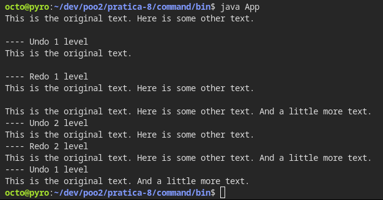

# Prática 08 - Command

## Instruções passadas:

Implemente completamente o exemplo do editor de texto mostrado na video aula.

ENTREGUE O CODIGO E UM PRINT DA TELA COM A EXECUÇÃO PROPOSTA NO EXEMPLO.

***

**Universidade Federal de Uberlândia**

**Ciência da Computação**

**Programação Orientada a Objetos 2**

**Aluno:** Otávio Almeida Leite

11911BCC010

---

Abaixo estão listados os prints de execução e o código fonte dos exercícios. Além deste documento, o código fonte também está disponível no repositório do GitHub destinado ao armazenamento dos códigos dessa disciplina.

Link do Repositório:

[GitHub - atoivat/poo2: Códigos referentes à disciplina de Programação Orientada a Objetos 2 na Universidade Federal de Uberlândia, 2021.](https://github.com/atoivat/poo2)

Link direto da pasta desta atividade:

[poo2/pratica-8 at master · atoivat/poo2](https://github.com/atoivat/poo2/tree/master/pratica-8)


# Execução





# Código Fonte

Estrutura do Projeto:
```txt
.
└── command
    └── src
        ├── App.java
        ├── Command.java
        ├── DocumentEditCommand.java
        ├── DocumentInvoker.java
        └── Document.java
```

App.java
```java
public class App {
    public static void main(String[] args) throws Exception {
        DocumentInvoker instance = new DocumentInvoker();
        instance.Write("This is the original text.");
        
        instance.Write(" Here is some other text.");
        System.out.println(instance.Read());
        System.out.println();

        
        instance.Undo(1);
        System.out.println(instance.Read());
        System.out.println();
        
        
        instance.Redo(1);
        System.out.println(instance.Read());
        System.out.println();
        
        
        instance.Write(" And a little more text.");
        System.out.println(instance.Read());
        instance.Undo(2);
        System.out.println(instance.Read());
        instance.Redo(2);
        System.out.println(instance.Read());
        instance.Undo(1);
        System.out.println(instance.Read());
    }
}

```

Command.java
```java
abstract class Command {
    abstract public void Redo();
    abstract public void Undo();
}
```

DocumentEditCommand.java
```java
public class DocumentEditCommand extends Command {
    private Document _editableDoc;
    private String _text;

    public DocumentEditCommand(Document doc, String text) {
        _editableDoc = doc;
        _text = text;
        _editableDoc.Write(_text);
    }

    public void Redo(){
        _editableDoc.Write(_text);
    }

    public void Undo(){
        _editableDoc.Erase(_text);
    }
    
}

```

DocumentInvoker.java
```java
import java.util.ArrayList;

public class DocumentInvoker {
    private ArrayList<Command> _commands = new ArrayList<Command>();
    private Document _doc = new Document();

    public void Redo(int level) {
        System.out.println("---- Redo " + level + " level");
        _commands.get(level).Redo();
    }
    
    public void Undo(int level) {
        System.out.println("---- Undo " + level + " level");
        _commands.get(level).Undo();
    }


    public void Write(String text) {
        DocumentEditCommand cmd = new DocumentEditCommand(_doc, text);
        _commands.add(cmd);
    }

    public String Read() {
        return _doc.ReadDocument();
    }
}

```

Document.java
```java
import java.util.ArrayList;

public class Document {
    private ArrayList<String> _textArray = new ArrayList<String>();

    public void Write(String text){
        _textArray.add(text);
    }
    
    public void Erase(String text){
        _textArray.remove(text);
    }
    
    public void Erase(int textLevel){
        _textArray.remove(textLevel);
    }

    public String ReadDocument(){
        String returnString = "";
        for(String txt: _textArray){
            returnString += txt;
        }
        return returnString;
    }
}

```