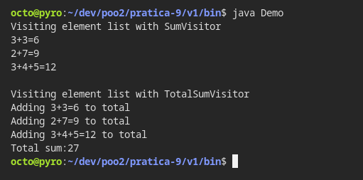
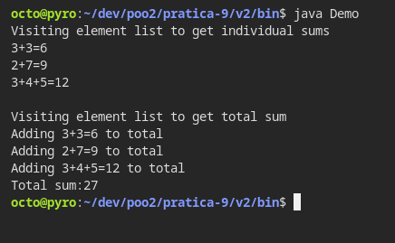
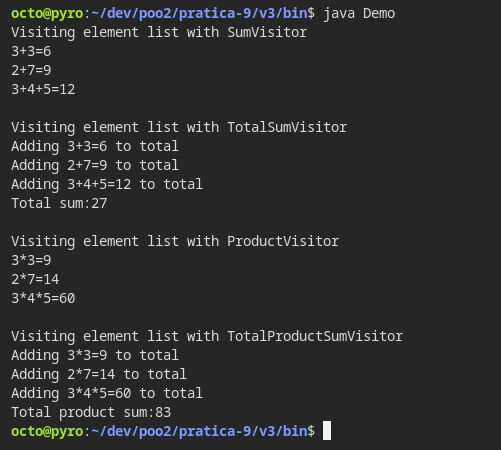

# Prática 09 - Visitor

## Instruções passadas:

Reproduza o exemplo de visitor da aula prática SumVisitor e TotalSumVisitor.

Em seguida, reescreva o programa retirando o padrão Visitor e implementando de maneira convencional preservando melhor o princípio da localidade e o encapsulamento.

Em seguida, aumente exemplo de visitor da aula para incluir novos visitor de Multiplicação e de Soma Total dos Elementos Multiplicados, similares aos existentes.

***
**Universidade Federal de Uberlândia**

**Ciência da Computação**

**Programação Orientada a Objetos 2**

**Aluno:** Otávio Almeida Leite

11911BCC010

---

Abaixo estão listados os prints de execução e o código fonte dos exercícios. Além deste documento, o código fonte também está disponível no repositório do GitHub destinado ao armazenamento dos códigos dessa disciplina.

Link do Repositório:

[GitHub - atoivat/poo2: Códigos referentes à disciplina de Programação Orientada a Objetos 2 na Universidade Federal de Uberlândia, 2021.](https://github.com/atoivat/poo2)

Link direto da pasta desta atividade:

[poo2/pratica-9 at master · atoivat/poo2](https://github.com/atoivat/poo2/tree/master/pratica-9)

Link direto da pasta da primeira parte desta atividade:

[poo2/pratica-9/v1 at master · atoivat/poo2](https://github.com/atoivat/poo2/tree/master/pratica-9/v1)

Link direto da pasta da segunda parte desta atividade:

[poo2/pratica-9/v2 at master · atoivat/poo2](https://github.com/atoivat/poo2/tree/master/pratica-9/v2)

Link direto da pasta da terceira parte desta atividade:

[poo2/pratica-9/v3 at master · atoivat/poo2](https://github.com/atoivat/poo2/tree/master/pratica-9/v3)


# Execução 

## Primeira parte





## Segunda parte





## Terceira parte





# Código Fonte

## Primeira parte
Estrutura do projeto:
```txt
.
└── src
    ├── Demo.java
    ├── NumberElement.java
    ├── NumberVisitor.java
    ├── SumVisitor.java
    ├── ThreeElement.java
    ├── TotalSumVisitor.java
    └── TwoElement.java
```

Demo.java
```java
import java.util.ArrayList;
import java.util.List;

public class Demo {
    public static void main(String[] args) throws Exception {
        TwoElement two1 = new TwoElement(3, 3);
        TwoElement two2 = new TwoElement(2, 7);
        ThreeElement three1 = new ThreeElement(3, 4, 5);

        List<NumberElement> numberElements = new ArrayList<NumberElement>();
        numberElements.add(two1);
        numberElements.add(two2);
        numberElements.add(three1);
        
        System.out.println("Visiting element list with SumVisitor");
        NumberVisitor sumVisitor = new SumVisitor();
        sumVisitor.visit(numberElements);
        
        System.out.println("\nVisiting element list with TotalSumVisitor");
        TotalSumVisitor totalSumVisitor = new TotalSumVisitor();
        totalSumVisitor.visit(numberElements);
        System.out.println("Total sum:" + totalSumVisitor.getTotalSum());
    }
}
```

NumberElement.java
```java
public interface NumberElement {
    public void accept(NumberVisitor visitor);
}
```

NumberVisitor.java
```java
import java.util.List;

public interface NumberVisitor {
    public void visit(TwoElement twoElement);
    public void visit(ThreeElement threeElement);
    public void visit(List<NumberElement> elementList);
}
```

SumVisitor.java
```java
import java.util.List;

public class SumVisitor implements NumberVisitor {
    
    @Override
    public void visit(TwoElement twoElement) {
        int sum = twoElement.a + twoElement.b;
        System.out.println(twoElement.a + "+" + twoElement.b + "=" + sum);
    }
    
    @Override
    public void visit(ThreeElement threeElement) {
        int sum = threeElement.a + threeElement.b + threeElement.c;
        System.out.println(threeElement.a + "+" + threeElement.b + "+" + threeElement.c + "=" + sum);
    }
    
    @Override
    public void visit(List<NumberElement> elementList) {
        for (NumberElement numberElement: elementList){
            numberElement.accept(this);
        }
    }
}
```

ThreeElement.java
```java
public class ThreeElement implements NumberElement {
    int a, b, c;

    public ThreeElement(int a, int b, int c) {
        this.a = a;
        this.b = b;
        this.c = c;
    }

    public void accept(NumberVisitor visitor) {
        visitor.visit(this);
    }
}
```

TotalSumVisitor.java
```java
import java.util.List;

public class TotalSumVisitor implements NumberVisitor {
    int totalSum = 0;

    @Override
    public void visit(TwoElement twoElement) {
        int sum = twoElement.a + twoElement.b;
        System.out.println("Adding " + twoElement.a + "+" + twoElement.b + "=" + sum + " to total");
        totalSum += sum;
    }
    
    @Override
    public void visit(ThreeElement threeElement) {
        int sum = threeElement.a + threeElement.b + threeElement.c;
        System.out.println("Adding " + threeElement.a + "+" + threeElement.b + "+" + threeElement.c + "=" + sum + " to total");
        totalSum += sum;
    }
    
    @Override
    public void visit(List<NumberElement> elementList) {
        for (NumberElement numberElement: elementList){
            numberElement.accept(this);
        }
    }

    public int getTotalSum() {
        return totalSum;
    }
}

```

TwoElement.java
```java
public class TwoElement implements NumberElement {
    int a, b;

    public TwoElement(int a, int b) {
        this.a = a;
        this.b = b;
    }

    public void accept(NumberVisitor visitor) {
        visitor.visit(this);
    }
}
```


## Segunda parte
Estrutura do projeto:
```txt
.
└── src
    ├── Demo.java
    ├── NumberElement.java
    ├── NumberElementList.java
    ├── ThreeElement.java
    └── TwoElement.java
```

Demo.java
```java
public class Demo {
    public static void main(String[] args) throws Exception {
        TwoElement two1 = new TwoElement(3, 3);
        TwoElement two2 = new TwoElement(2, 7);
        ThreeElement three1 = new ThreeElement(3, 4, 5);

        NumberElementList numberElements = new NumberElementList();
        numberElements.add(two1);
        numberElements.add(two2);
        numberElements.add(three1);
        
        System.out.println("Visiting element list to get individual sums");
        numberElements.sum();
        
        System.out.println("\nVisiting element list to get total sum");
        System.out.println("Total sum:" + numberElements.totalSum());
    }
}
```

NumberElement.java
```java
public interface NumberElement {
    public void sum();
    public int totalSum();
}
```

NumberElementList.java
```java
import java.util.ArrayList;
import java.util.List;

public class NumberElementList implements NumberElement {
    private List<NumberElement> list = new ArrayList<NumberElement>();

    public void add(NumberElement numberElement){
        list.add(numberElement);
    }

    public void sum() {
        for (NumberElement numberElement: list) {
            numberElement.sum();
        }
    }
    
    public int totalSum(){
        int totalSum = 0;
        for (NumberElement numberElement: list) {
            totalSum += numberElement.totalSum();
        }
        return totalSum;
    }
}
```

ThreeElement.java
```java
public class ThreeElement implements NumberElement {
    int a, b, c;

    public ThreeElement(int a, int b, int c) {
        this.a = a;
        this.b = b;
        this.c = c;
    }

    public void sum() {
        int sum = a + b + c;
        System.out.println(a + "+" + b + "+" + c + "=" + sum);
    }

    public int totalSum(){
        int sum = a + b + c;
        System.out.println("Adding " + a + "+" + b + "+" + c + "=" + sum + " to total");
        return sum;
    }
}
```

TwoElement.java
```java
public class TwoElement implements NumberElement {
    int a, b;

    public TwoElement(int a, int b) {
        this.a = a;
        this.b = b;
    }

    public void sum() {
        int sum = a + b;
        System.out.println(a + "+" + b + "=" + sum);
    }

    public int totalSum() {
        int sum = a + b;
        System.out.println("Adding " + a + "+" + b + "=" + sum + " to total");
        return sum;
    }
}
```


## Terceira parte
Estrutura do projeto:
```txt
└── src
    ├── Demo.java
    ├── NumberElement.java
    ├── NumberVisitor.java
    ├── ProductVisitor.java
    ├── SumVisitor.java
    ├── ThreeElement.java
    ├── TotalProductSumVisitor.java
    ├── TotalSumVisitor.java
    └── TwoElement.java
```

Demo.java
```java
import java.util.ArrayList;
import java.util.List;

public class Demo {
    public static void main(String[] args) throws Exception {
        TwoElement two1 = new TwoElement(3, 3);
        TwoElement two2 = new TwoElement(2, 7);
        ThreeElement three1 = new ThreeElement(3, 4, 5);

        List<NumberElement> numberElements = new ArrayList<NumberElement>();
        numberElements.add(two1);
        numberElements.add(two2);
        numberElements.add(three1);
        
        System.out.println("Visiting element list with SumVisitor");
        NumberVisitor sumVisitor = new SumVisitor();
        sumVisitor.visit(numberElements);
        
        System.out.println("\nVisiting element list with TotalSumVisitor");
        TotalSumVisitor totalSumVisitor = new TotalSumVisitor();
        totalSumVisitor.visit(numberElements);
        System.out.println("Total sum:" + totalSumVisitor.getTotalSum());
        
        System.out.println("\nVisiting element list with ProductVisitor");
        NumberVisitor productVisitor = new ProductVisitor();
        productVisitor.visit(numberElements);
        
        System.out.println("\nVisiting element list with TotalProductSumVisitor");
        TotalProductSumVisitor totalProductSumVisitor = new TotalProductSumVisitor();
        totalProductSumVisitor.visit(numberElements);
        System.out.println("Total product sum:" + totalProductSumVisitor.getTotalProductSum());
    }
}
```

NumberElement.java
```java
public interface NumberElement {
    public void accept(NumberVisitor visitor);
}
```

NumberVisitor.java
```java
import java.util.List;

public interface NumberVisitor {
    public void visit(TwoElement twoElement);
    public void visit(ThreeElement threeElement);
    public void visit(List<NumberElement> elementList);
}
```

ProductVisitor.java
```java
import java.util.List;

public class ProductVisitor implements NumberVisitor {

    @Override
    public void visit(TwoElement twoElement) {
        int product = twoElement.a * twoElement.b;
        System.out.println(twoElement.a + "*" + twoElement.b + "=" + product);
    }
    
    @Override
    public void visit(ThreeElement threeElement) {
        int product = threeElement.a * threeElement.b * threeElement.c;
        System.out.println(threeElement.a + "*" + threeElement.b + "*" + threeElement.c + "=" + product);
    }
    
    @Override
    public void visit(List<NumberElement> elementList) {
        for (NumberElement numberElement: elementList){
            numberElement.accept(this);
        }
    }
}
```

SumVisitor.java
```java
import java.util.List;

public class SumVisitor implements NumberVisitor {
    
    @Override
    public void visit(TwoElement twoElement) {
        int sum = twoElement.a + twoElement.b;
        System.out.println(twoElement.a + "+" + twoElement.b + "=" + sum);
    }
    
    @Override
    public void visit(ThreeElement threeElement) {
        int sum = threeElement.a + threeElement.b + threeElement.c;
        System.out.println(threeElement.a + "+" + threeElement.b + "+" + threeElement.c + "=" + sum);
    }
    
    @Override
    public void visit(List<NumberElement> elementList) {
        for (NumberElement numberElement: elementList){
            numberElement.accept(this);
        }
    }
}
```

ThreeElement.java
```java
public class ThreeElement implements NumberElement {
    int a, b, c;

    public ThreeElement(int a, int b, int c) {
        this.a = a;
        this.b = b;
        this.c = c;
    }

    public void accept(NumberVisitor visitor) {
        visitor.visit(this);
    }
}
```

TotalProductSumVisitor.java
```java
import java.util.List;

public class TotalProductSumVisitor implements NumberVisitor {
    int totalProductSum = 0;

    @Override
    public void visit(TwoElement twoElement) {
        int product = twoElement.a * twoElement.b;
        System.out.println("Adding " + twoElement.a + "*" + twoElement.b + "=" + product + " to total");
        totalProductSum += product;
    }
    
    @Override
    public void visit(ThreeElement threeElement) {
        int product = threeElement.a * threeElement.b * threeElement.c;
        System.out.println("Adding " + threeElement.a + "*" + threeElement.b + "*" + threeElement.c + "=" + product + " to total");
        totalProductSum += product;
    }
    
    @Override
    public void visit(List<NumberElement> elementList) {
        for (NumberElement numberElement: elementList){
            numberElement.accept(this);
        }
    }

    public int getTotalProductSum() {
        return totalProductSum;
    }

}
```

TotalSumVisitor.java
```java
import java.util.List;

public class TotalSumVisitor implements NumberVisitor {
    int totalSum = 0;

    @Override
    public void visit(TwoElement twoElement) {
        int sum = twoElement.a + twoElement.b;
        System.out.println("Adding " + twoElement.a + "+" + twoElement.b + "=" + sum + " to total");
        totalSum += sum;
    }
    
    @Override
    public void visit(ThreeElement threeElement) {
        int sum = threeElement.a + threeElement.b + threeElement.c;
        System.out.println("Adding " + threeElement.a + "+" + threeElement.b + "+" + threeElement.c + "=" + sum + " to total");
        totalSum += sum;
    }
    
    @Override
    public void visit(List<NumberElement> elementList) {
        for (NumberElement numberElement: elementList){
            numberElement.accept(this);
        }
    }

    public int getTotalSum() {
        return totalSum;
    }
}
```

TwoElement.java
```java
public class TwoElement implements NumberElement {
    int a, b;

    public TwoElement(int a, int b) {
        this.a = a;
        this.b = b;
    }

    public void accept(NumberVisitor visitor) {
        visitor.visit(this);
    }
}
```
